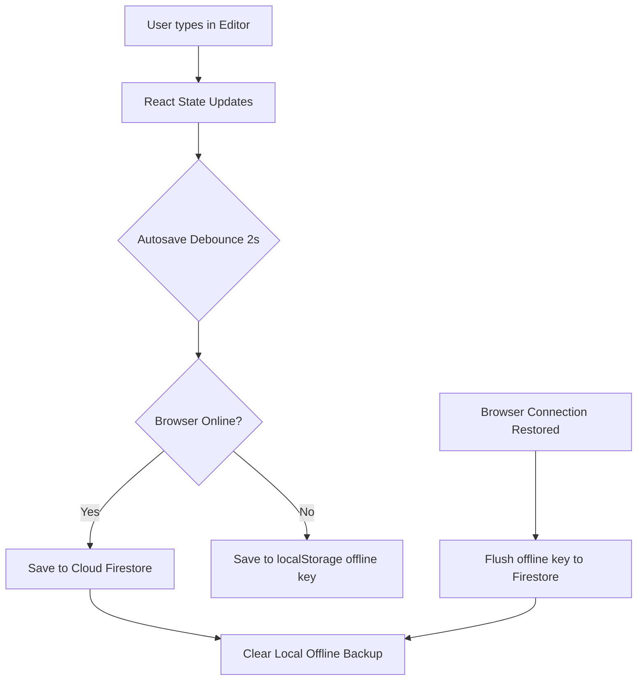

# 🎬 लेखन मंच (Lekhan Manch) — Screenplay, Natak & Story Writer

<p align="center">
  
  
  
  
</p>

**लेखन मंच** is a premium, minimal, distraction-free writing environment specifically tailored for **Hindi Screenplays, Nataks (plays), and Stories**. Built with React, Vite, and Cloud Firestore, it combines industry-standard block formats with instant cloud synchronization, automatic offline safety backups, and high-fidelity paginated layouts.

---

## ✨ Key Features

*   🎭 **Three Dedicated Writing Modes**:
    *   **Screenplay**: Scene Heading, Action, Character, Dialogue, Parenthetical, Transition.
    *   **Drama (Natak)**: Act (अंक), Scene (दृश्य), Stage Direction (निर्देश), Character (पात्र), Dialogue (संवाद).
    *   **Story**: Chapter Titles, Prose Paragraphs, and Section Breaks.
*   📄 **High-Fidelity Pagination**: A real-time, responsive A4 page simulation. Page breaks are computed dynamically without disrupting keyboard focus or text entry.
*   💾 **Instant Cloud Sync**: Debounced autosaving directly to **Firebase Cloud Firestore**.
*   📴 **Bulletproof Offline Support**: Detects connection loss instantly, caches pending edits locally, and automatically flushes drafts to the cloud when reconnected.
*   🎨 **Interactive Toolbar**: Color picker for styling blocks, customizable custom block types, undo/redo history per mode, and bookmark navigation.
*   🔒 **Secure Authentication**: Integrated Google OAuth 2.0 via Firebase JS SDK.

---

## 🏗️ Synchronization & Offline Architecture

The app manages document state dynamically between the local browser storage and the Firestore database:



---

## 🛠️ Folder Structure Overview

```
src/
├── firebase/
│   ├── config.js           # Firebase app initialization & Auth/DB configuration
│   └── draftsService.js    # Pure Firestore CRUD methods (save, delete, subscribe)
├── context/
│   ├── AuthContext.jsx     # Google Authentication state provider
│   └── DocumentContext.jsx # Document editing state, autosave, & offline synchronization
├── components/
│   ├── Auth/
│   │   ├── SignInScreen.jsx   # Premium minimal sign-in screen
│   │   └── LoadingSpinner.jsx # Center-aligned loading animation
│   ├── Editor/
│   │   ├── Editor.jsx      # Dynamic paginated writing surface
│   │   └── Block.jsx       # Individual block input with auto-expanding fields
│   ├── Modals/
│   │   ├── DraftManager.jsx    # Real-time sync drafts portal
│   │   ├── DocumentActions.jsx # Import/export settings (Word, PDF, Text)
│   │   └── CustomBlockModal.jsx # Custom block creator & styler
│   ├── Header.jsx          # Mode selectors, sync indicators, user avatar dropdown
│   ├── Toolbar.jsx         # Context-sensitive formatting tool belt
│   ├── Sidebar.jsx         # Bookmarks navigation & helper cheatsheets
│   └── ColorPicker.jsx     # Text formatting colors picker
├── App.jsx                 # Protected route authentication gate
└── main.jsx                # Entry point injecting context providers
```

---

## 🚀 Quick Start Guide

### Prerequisites
*   **Node.js** v18 or higher
*   **npm** or **yarn**
*   A **Firebase Project** with Authentication (Google Auth enabled) & Cloud Firestore database created.

### 1. Installation
Clone the repository and install all dependencies:
```bash
git clone https://github.com/ayushcode001/screen-play.git
cd screen-play
npm install
```

### 2. Environment Configuration
Create a `.env.local` file by copying the template:
```bash
cp .env.example .env.local
```
Fill in the template with your Firebase credentials:
```env
VITE_FIREBASE_API_KEY=your_api_key
VITE_FIREBASE_AUTH_DOMAIN=your_auth_domain
VITE_FIREBASE_PROJECT_ID=your_project_id
VITE_FIREBASE_STORAGE_BUCKET=your_storage_bucket
VITE_FIREBASE_MESSAGING_SENDER_ID=your_messaging_sender_id
VITE_FIREBASE_APP_ID=your_app_id
VITE_FIREBASE_MEASUREMENT_ID=your_measurement_id
```

### 3. Run Locally
Start the development server:
```bash
npm run dev
```
Open **`http://localhost:5173`** in your browser.

---

## ⚡ Deployment & Hosting (Vercel)

### 1. Build and Test
Verify that the production build compiles cleanly:
```bash
npm run build
```

### 2. Connect Project
Import the GitHub repository into your Vercel Account. Ensure you add all **7 Firebase credentials** (`VITE_FIREBASE_*`) to the **Environment Variables** tab in your Vercel Project Settings.

### 3. Register Authorized Domain
Once deployed, copy your production Vercel URL (e.g., `screen-play-delta.vercel.app`) and add it to:
**Firebase Console** → **Authentication** → **Settings** (tab) → **Authorized domains**.

---

## 📄 License
Licensed under the [MIT License](LICENSE).
